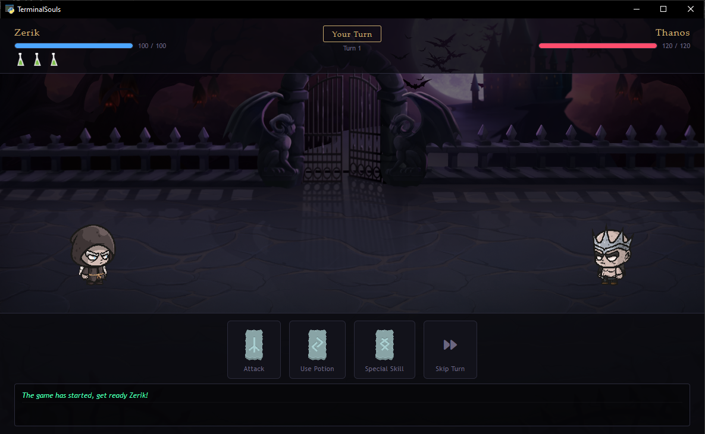

# TerminalSouls


> También disponible en [English](README.md) &nbsp;|&nbsp; Ver [Créditos](CREDITS.md)

<p align="center">
  
</p>

TerminalSouls es un juego de combate por turnos construido íntegramente en Python y renderizado en una ventana de escritorio nativa mediante PyWebView. El jugador se enfrenta a un único enemigo en una batalla táctica que involucra ataques, pociones de curación y un sistema de habilidades especiales con una mecánica de rabia. La capa visual es una interfaz HTML/CSS/JS construida a mano con animaciones de sprites fotograma a fotograma, fondos dinámicos y estado de UI reactivo.

---

## Tabla de Contenidos

- [Características](#características)
- [Estructura del Proyecto](#estructura-del-proyecto)
- [Requisitos](#requisitos)
- [Instalación](#instalación)
- [Ejecutar el Juego](#ejecutar-el-juego)
- [Jugabilidad](#jugabilidad)
- [Créditos](#créditos)

---

## Características

- Motor de combate por turnos escrito en Python puro
- Ventana de escritorio nativa mediante PyWebView sin necesidad de navegador externo
- Animaciones de sprites fotograma a fotograma para todas las acciones de combate
- Mecánica de estado de rabia que potencia el siguiente ataque y habilidad especial del héroe
- Variantes de héroe masculino y femenino seleccionables al inicio
- Fondo de batalla elegido aleatoriamente en cada sesión
- Sistema de pociones de curación con animación visual flotante
- Registro de combate con mensajes diferenciados por color

---

## Estructura del Proyecto

```
TerminalSouls/
├── assets/
│   ├── css/
│   │   ├── index/
│   │   │   └── index.css
│   │   └── lib/
│   │       └── all.min.css          # Font Awesome (copia local)
│   ├── images/
│   │   └── ui/
│   │       ├── backgrounds/         # Fondos de batalla (1 al 4)
│   │       ├── characters/
│   │       │   ├── hero/
│   │       │   │   ├── male/        # Dying, Hurt, Idle, Slashing, Sliding
│   │       │   │   └── female/
│   │       │   └── enemy/
│   │       │       └── male/
│   │       ├── items/               # fullPotion.png, emptyPotion.png
│   │       └── skills/icons/        # Íconos de runas
│   └── js/
│       └── index/
│           └── index.js
├── templates/
│   └── index/
│       └── index.html
├── character.py
├── gameEngine.py
├── gui.py
├── run.py
├── utils/
│   ├── __init__.py
│   └── commons.py
├── requirements.txt
├── README.md
├── README.es.md
└── CREDITS.md
```

---

## Requisitos

- Python 3.13
- Windows 10/11, macOS o Ubuntu/Debian Linux

### Dependencias de Python

Todas las dependencias están listadas en `requirements.txt`. Las principales son:

- `pywebview` — renderiza la interfaz HTML/CSS/JS dentro de una ventana de escritorio nativa
- `colorama` — salida con colores en la terminal durante el arranque

---

## Instalación

### 1. Clonar el repositorio

```bash
git clone https://github.com/Zerik-Official/TerminalSouls
cd TerminalSouls
```

### 2. Crear y activar un entorno virtual

**Windows**
```bash
python -m venv venv
venv\Scripts\activate
```

**macOS / Linux**
```bash
python3 -m venv venv
source venv/bin/activate
```

### 3. Instalar las dependencias de Python

```bash
pip install -r requirements.txt
```

### Solo Linux — librerías del sistema requeridas por PyWebView

En distribuciones basadas en Ubuntu o Debian, PyWebView depende de paquetes del sistema GTK y WebKit2. Instálalos antes de ejecutar el juego:

```bash
sudo apt update && sudo apt install -y \
    python3-dev \
    libgirepository-2.0-dev \
    libcairo2-dev \
    pkg-config \
    gir1.2-gtk-3.0 \
    gir1.2-webkit2-4.1
```

Luego instala los bindings de Python:

```bash
pip install PyGObject pycairo pywebview
```

---

## Ejecutar el Juego

**Windows / macOS**
```bash
python run.py
```

**Linux**
```bash
python3 run.py
```

El lanzador detecta tu sistema operativo, selecciona el backend apropiado de PyWebView y abre la ventana del juego.

---

## Jugabilidad

### Configuración inicial

Al iniciar, ingresa el nombre de tu guerrero (solo letras, máximo 20 caracteres) y selecciona el género. La elección del género determina qué conjunto de sprites se usará durante toda la sesión.

### Acciones de Combate

| Acción | Descripción |
|---|---|
| Atacar | Inflige daño físico al enemigo. Tiene un 10% de probabilidad de asestar un golpe crítico con el doble de daño. |
| Usar Poción | Consume una de las 3 pociones para recuperar entre 10 y 20 puntos de vida. |
| Habilidad Especial | Habilidad poderosa con 50% de probabilidad de éxito que inflige entre 30 y 50 de daño al acertar. |
| Pasar Turno | Pasa sin actuar. El héroe se detiene y el enemigo toma su turno. |

### Mecánica de Rabia

Si el enemigo esquiva la habilidad especial del héroe, el héroe entra en estado de rabia. Mientras está enrabiado, el siguiente ataque será un golpe crítico garantizado que no puede ser esquivado, y el siguiente uso de la habilidad especial también tendrá éxito garantizado y no podrá ser esquivado. El estado de rabia se indica mediante un aura roja pulsante alrededor del héroe y bordes rojos brillantes en las cartas de habilidad afectadas.

### Comportamiento del Enemigo

El enemigo actúa automáticamente después de cada turno del jugador. Si su vida cae al 20% o menos, intentará curarse canalizando energía oscura con un 50% de probabilidad de éxito, recuperando entre 20 y 30 puntos de vida. Luego ataca al héroe con un golpe que puede ser crítico o normal. El héroe tiene un 10% de probabilidad de esquivar cualquier ataque enemigo.

---

## Créditos

Consulta [CREDITS.md](CREDITS.md) para ver la atribución completa de todos los recursos y librerías de terceros utilizados en este proyecto.